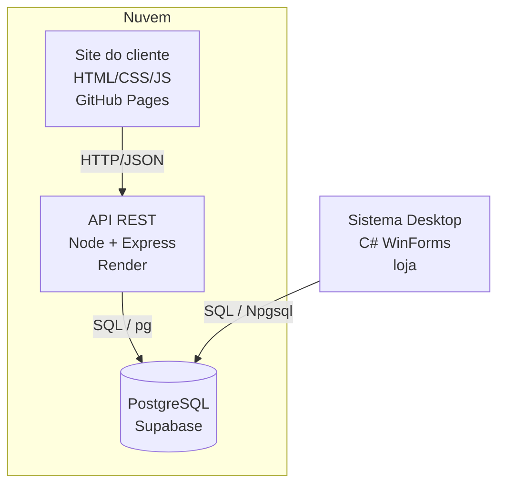
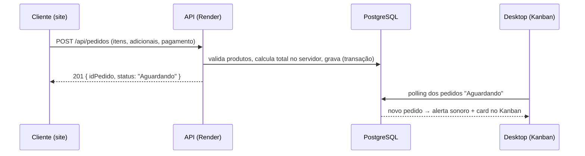

# Arquitetura — DevBurguer

Documento técnico da arquitetura do sistema: componentes, fluxo de dados,
camadas internas e decisões de projeto.

## 1. Visão geral

O DevBurguer segue uma arquitetura de **integração de sistemas**: três aplicações
clientes independentes compartilham um **único banco de dados** como fonte da verdade.



- **Site** e **Desktop** nunca falam entre si diretamente — a integração acontece
  pelo **banco compartilhado**.
- O site acessa o banco **indiretamente** (via API), por ser um cliente externo/público.
- O desktop acessa o banco **diretamente** (Npgsql), por ser uma aplicação interna de confiança.

## 2. Fluxo de um pedido feito no site



Regras de segurança do pedido: o **total é sempre recalculado no servidor** (nunca
confia no preço enviado pelo cliente) e os **adicionais são cobrados pelos preços do
banco**. Tudo grava em transação (ou tudo, ou nada).

## 3. Camadas do sistema desktop

O desktop é organizado em camadas, com a dependência sempre apontando "pra dentro":

```
Forms (UI)  ─▶  Services (regras: previsão, cupom, som)  ─▶  Data (repositórios)  ─▶  Npgsql ─▶ PostgreSQL
```

- **Forms:** apenas interface; não contêm SQL.
- **Services:** regras de negócio (regressão linear da previsão, geração do cupom, alerta sonoro).
- **Data (repositórios + DbHelper):** único lugar com SQL; isola o banco do resto.
- **Banco/Conexao:** string de conexão em `config.txt` (fora do Git), editável em runtime.

## 4. Estrutura da API

```
DevBurguer-API/api/src/
├── server.js            # bootstrap do Express + CORS por ambiente
├── db/db.js             # pool de conexões (node-postgres)
├── config/categorias.js # mapeia categoria do banco -> slug do site
└── rotas/
    ├── produtos.js      # GET /produtos, /categorias, /mais-vendidos
    └── pedidos.js       # POST /pedidos, GET /pedidos/:id/status
```

## 5. Decisões de projeto

| Decisão | Motivo |
|---------|--------|
| **PostgreSQL** (em vez de SQL Server) | Código aberto e hospedagem gratuita em nuvem (Supabase), sem cartão. |
| **Banco único** | Elimina duplicação e sincronização; integra site e desktop em tempo real. |
| **Total calculado no servidor** | Segurança: impede falsificação de preço pelo cliente. |
| **Site em `docs/`** | Restrição do GitHub Pages (publica a raiz ou `/docs`). |
| **Desktop direto no banco** | App interno; a API fica reservada ao canal público (site). |

## 6. Deploy

| Componente | Plataforma | Origem |
|------------|-----------|--------|
| Site       | GitHub Pages | branch `main`, pasta `docs/` |
| API        | Render (free) | branch `main`, pasta `DevBurguer-API/api` (auto-deploy On Commit) |
| Banco      | Supabase | scripts em `database/` |

> O plano gratuito do Render "dorme" após 15 min de inatividade; a primeira
> requisição depois disso pode levar ~30-50s para responder.
